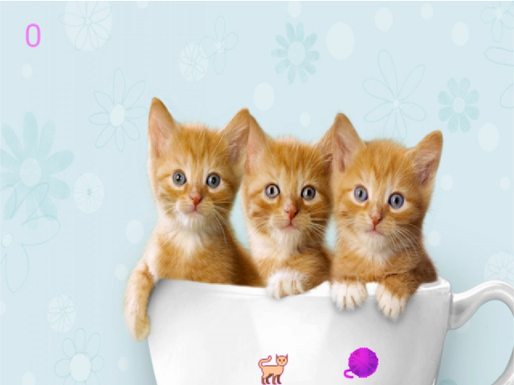
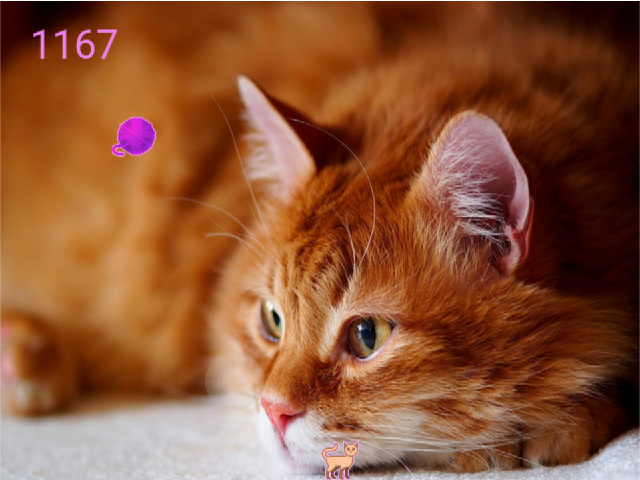
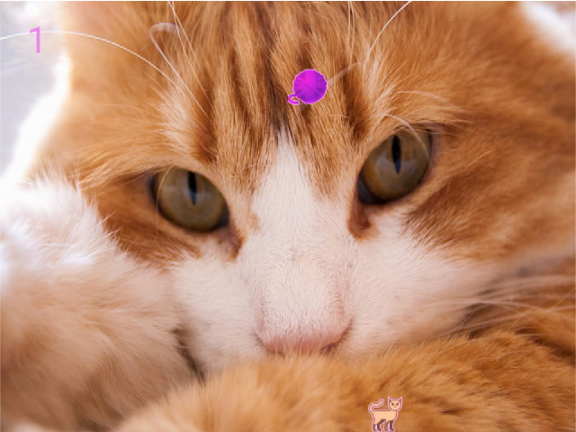
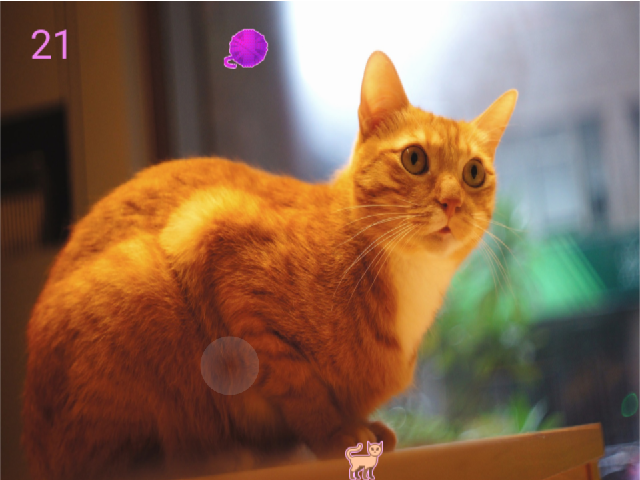

# Proyecto Tinger y el Estambre

🐈🐈🐈🐈🐈🐈🐈🐈🐈🐈🐈🐈🐈🐈🐈🐈🐈🐈🐈🐈🐈🐈🐈

### Generalidades 🐱👓

Es un juego de plataforma realizado en Python. Consiste en mover a <b>Tinger, el gato primordial</b> 🐱👤 en el borde
inferior de la pantalla para evitar que la bola de estambre caiga en dicho lugar.

### Descarga 🌌

Para descargar el juego simplemente ingresa a https://github.com/EduardoProfe666/Proyecto-Tinger-y-el-Estambre/releases/latest . Para ejecutarlo simplemente abre el
fichero `Tinger y el Estambre.exe` y disfruta 🐱🐉.

### Controles 🐱🚀

Para mover a <b>Tinger, el gato primordial</b> 🐱👤 se usan los siguientes controles:
- 🢂 <b>Flecha Derecha:</b> Para mover a Tinger a la derecha.
- 🢀 <b>Flecha Izquierda:</b> Para mover a Tinger a la izquierda.
- ➖ <b>Espacio: </b> Para "incentivar" a Tinger 😸.

### Testers 🐱💻

Los `testers` actuales son:
- (Lilian Rojas)[@LilyRosa]
- (Yankiel Yong)[@YankielYong]

### Capturas de Pantalla 😼

🐈🐈🐈🐈🐈🐈🐈🐈🐈🐈🐈🐈🐈🐈🐈🐈🐈🐈🐈🐈🐈🐈🐈
